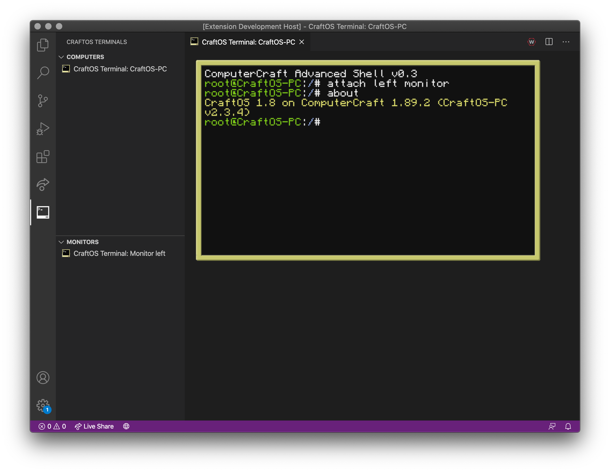

# CraftOS-PC for VS Code README (alpha)

An extension for Visual Studio Code adding a bunch of new features to help you write ComputerCraft code easier through CraftOS-PC.

**This is an alpha version - expect some bugs and missing features.**

## Features

* Support for built-in CraftOS-PC terminals in VS Code
* Adds new commands to quickly open computer data folders or configuration files
* More?

## Requirements

* CraftOS-PC v2.3 or later (https://www.craftos-pc.cc)
  * If using more than one terminal, CraftOS-PC v2.3.4 and earlier will not work due to a bug causing multiple terminals to get the same ID
  * If on Windows, make sure to install the console version as well under Optional components in the installer
  * If installed in a non-standard directory (such as in your user directory), make sure to set `craftos-pc.executablePath` in the settings

## Recommended Extensions

* [ComputerCraft by JackMacWindows (me!)](https://marketplace.visualstudio.com/items?itemName=jackmacwindows.vscode-computercraft) for ComputerCraft autocomplete
* [Lua by sumneko](https://marketplace.visualstudio.com/items?itemName=sumneko.lua) for Lua syntax highlighting & linting

## Extension Settings

This extension contributes the following settings:

* `craftos-pc.executablePath.[windows|mac|linux|all]`: Path to the CraftOS-PC executable depending on the platform. This should be an absolute path to an executable supporting console output (on Windows, this must be pointing to a copy of `CraftOS-PC_console.exe`, which is optionally available in the installer).
* `craftos-pc.dataPath`: Path to the data directory storing computer files, configuration, etc.

## Known Issues

* Switching to another tab and back may cause keyboard input to stop working.
  * Workaround: Switch windows and back to make the keyboard work again.
* There may be some latency when typing things into the terminal.

## Release Notes

### 0.1.1

Fixes a bug where the wrong key events were being sent (e.g. `key_up` when pressing a key down). Also fixes `char` events being sent with modifier keys held.

Download the latest build of CraftOS-PC (from 7/27/20 or later) to fix a bug with events being sent to the wrong window, as well as a bug preventing Ctrl-R/S/T from working properly.

### 0.1.0

First public alpha release.
