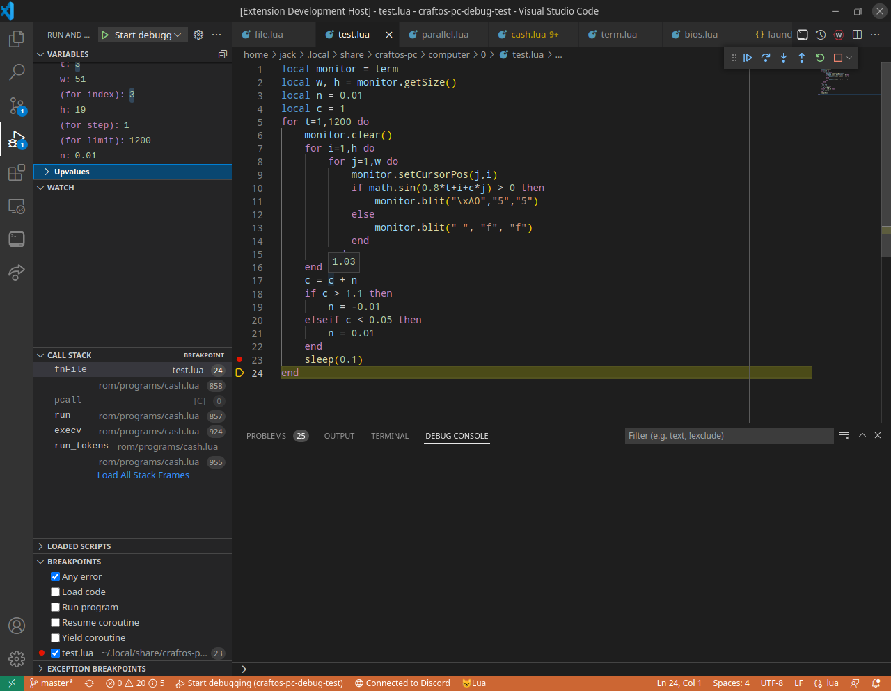

# CraftOS-PC for VS Code README

An extension for Visual Studio Code adding a bunch of new features to help you write ComputerCraft code easier through CraftOS-PC.

## Features

* Support for built-in CraftOS-PC terminals in VS Code
* Quickly access computer data directories and the configuration
* Run ComputerCraft Lua scripts in CraftOS-PC
* Browse files on the connected computer in the current workspace
* Connect to CraftOS-PC raw mode WebSocket servers
* Use the remote.craftos-pc.cc service to open any ComputerCraft computer in VS Code (beta)
* Debug code directly in VS Code using the native debugger interface




## Requirements

* CraftOS-PC v2.3 or later (https://www.craftos-pc.cc)
  * **If on Windows, make sure to install the console version as well under Optional components in the installer**
  * If installed in a non-standard directory (such as in your user directory), make sure to set `craftos-pc.executablePath` in the settings
  * See "Known issues" for caveats for certain CraftOS-PC versions
  * If you only want to use remote.craftos-pc.cc, you do not have to install CraftOS-PC

## Recommended Extensions

* [ComputerCraft by JackMacWindows (me!)](https://marketplace.visualstudio.com/items?itemName=jackmacwindows.vscode-computercraft) for ComputerCraft autocomplete
* [Lua by sumneko](https://marketplace.visualstudio.com/items?itemName=sumneko.lua) for Lua syntax highlighting & linting

## Extension Settings

This extension contributes the following settings:

* `craftos-pc.executablePath.[windows|mac|linux|all]`: Path to the CraftOS-PC executable depending on the platform. This should be an absolute path to an executable supporting console output (on Windows, this must be pointing to a copy of `CraftOS-PC_console.exe`, which is optionally available in the installer).
* `craftos-pc.dataPath`: Path to the data directory storing computer files, configuration, etc.
* `craftos-pc.additionalArguments`: Additional command-line arguments to send to CraftOS-PC, separated by spaces.
* `craftos-pc.customFont.path`: The path to a custom font, if desired. Must be a path to a valid image, or 'hdfont' to automatically find the HD font. Unlike normal CraftOS-PC, this may point to non-BMP files as well.

## Known Issues

* Occasionally, keyboard input may stop working. To fix this, click outside the CraftOS-PC window and then back in.
* Scroll events do not report the position of the scroll. This is a limitation of JavaScript.
* Live Share support does not respect read-only mode due to a limitation in the Live Share API.
* Some versions of CraftOS-PC have bugs that interfere with the functioning of this extension:
  * The debugger only works on CraftOS-PC v2.7 or later.
  * Filesystem access only works on CraftOS-PC v2.6 or later, or any server implementing raw mode 1.1 or later.
  * v2.5.4-v2.5.5: Creating a new window results in a crash. This is fixed in v2.6.
  * v2.5.1-v2.5.1.1: CraftOS-PC often crashes in raw mode on these versions. This is fixed in v2.5.2.
  * v2.3-v2.3.4: All events are sent to the first window, and all windows have the same ID. This is fixed in v2.4.

### Live Share

The VS Code Live Share extension uses a permission list to check whether an extension is allowed to use certain parts of the API. Unfortunately, that list does not include this extension (yet), so Live Share support requires creating a special config file to enable it manually.

To fix this, create a file called `.vs-liveshare-settings.json` in your home folder, and paste this inside the file:

```json
{
    "extensionPermissions": {
        "JackMacWindows.craftos-pc": [
            "shareServices"
        ]
    }
}
```

Then reload VS Code and run Live Share again.

## Release Notes

## 1.2.2

* Fixed an issue preventing uploading files between 48-64 kB in size

## 1.2.1

* Added automatic detection of user installations on Windows
* Adjusted some error messages to be more descriptive
* Added a new output channel for debugging messages

## 1.2.0

* Added debugger support for CraftOS-PC v2.7 and later
* Added support for Visual Studio Live Share
  * This currently requires manually allowing the extension to communicate

## 1.1.8

* Fixed a bug causing disconnections when sending large data packets

## 1.1.6

* Added Run Script button to quickly run files in a new CraftOS-PC instance

## 1.1.5

* Added history to Open WebSocket button

## 1.1.4

* Terminal windows now automatically resize to fit the screen
* Fixed an issue causing the bug info prompt from 1.1.3 to not appear

## 1.1.3

* Added more information about VS Code "certificate has expired" bug
* Added a "CraftOS-PC: Force Close Connection" to close the connection immediately without waiting for a response
* Fixed an issue causing remote screens to go black

## 1.1.1

* Fixed mouse_up event not being sent

## 1.1.0

* Added ability to connect to WebSocket servers
* Added integration with new remote.craftos-pc.cc service (beta)
* Added support for raw mode 1.1 specification
* Added URI handler for WebSocket links
* Fixed security vulnerability in glob-parent dependency

## 1.0.2

* Fixed wrong mouse buttons being sent
* Fixed drag coordinates in the margins of the screen
* Fixed mouse drag events firing in the same cell after click

## 1.0.1

* Fixed mouse events not being sent to the window

## 1.0.0

* Added support for custom fonts
  * Font files must be in the exact same format as ComputerCraft fonts (with the same outer padding area)
* Added close buttons to each window, as well as a global quit button
* Added buttons to open a new window with the selected computer's data directory
  * This requires either CraftOS-PC v2.5.6 or later, or computers labeled "Computer &gt;id&lt;"
* Added button to open the configuration
* Added paste event detection
* Added icons for monitors
* Updated extension icon to CraftOS-PC v2.4's new icon
* Fixed duplicate drag events being sent for the same character cell
* Fixed mouse events sending the wrong coordinates
* Fixed the computer background not being drawn properly
* Upgraded y18n and lodash to fix vulnerabilities (#3, #4)
* Reformatted code to be a bit more clean

### 0.2.1

* Added an error message if the executable is missing
* Fixed `mouse_click` events being sent instead of `mouse_drag`

### 0.2.0

* Fixed performance issues causing high CPU usage and major slowdown
  * Render speed should now be about the same as in standard GUI mode
* Added `craftos-pc.additionalArguments` setting
* Added command to close the emulator session without having to close each window
* Fixed a bug causing CraftOS-PC to not start on Windows when a workspace is open

### 0.1.1

Fixes a bug where the wrong key events were being sent (e.g. `key_up` when pressing a key down). Also fixes `char` events being sent with modifier keys held.

Download the latest build of CraftOS-PC (from 7/27/20 or later) to fix a bug with events being sent to the wrong window, as well as a bug preventing Ctrl-R/S/T from working properly.

### 0.1.0

First public alpha release.
